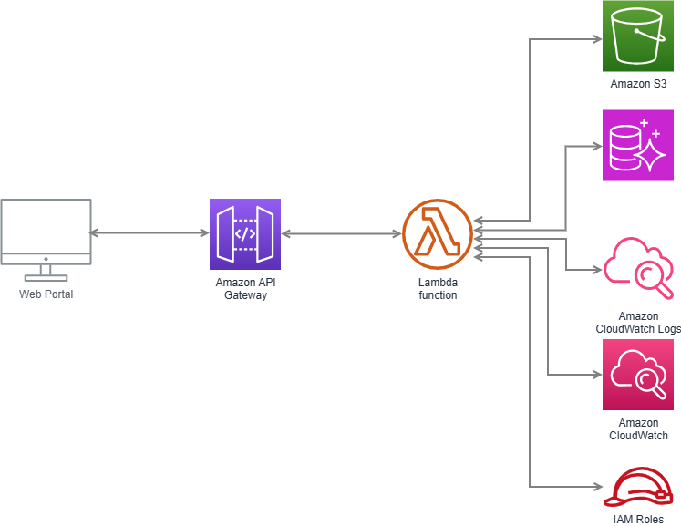
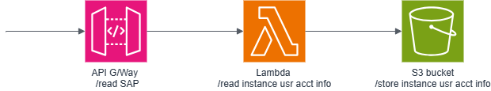

---

## SAP Account consolidation across all customer SAP instances

The development of a web portal to create a consolidated matrix view of user accounts across all customer SAP instances to aid in the timely removal of accounts where access is no longer required for a user to a specific SAP instance

---

### Description

This project consists of a number of AWS platforms and components as follows:
1. Single VPC (VPC-A - Shared services)
2. Multiple EC2 instances (Grafana, Django Portal, Aurora DB, Strongswan host etc. )
3. An API Gateway
4. Multiple S3 buckets for data loading and updates

---

### Architecture

The System Architecure is depicted below:

---

The system works as follows:
1.  

---

### System Component Diagrams

---

API Gateway to Lambda Data Flow

   
---

S3 bucket to Aurora DB data flow

---
